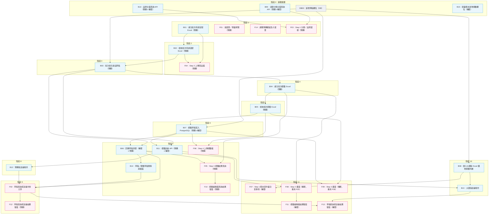

# SCM 預購／轉單批次提報（含標籤）— 系統分析與開發說明書

## 文件說明

- **Jira 主單：** [ECB2E-9967](https://pxec.atlassian.net/browse/ECB2E-9967) SCM > 預購 > 批次申請全聯貨號（UI／UX 重構）
- **文件範圍：** 完整 WBS 清單（含 Jira 連結）與開發順序流程圖
- **詳細說明：** 各項目內容、對應步驟及相依理由，請參閱 `SCM預購轉單標籤化_WBS分析與建議.md`

## 目錄

- [1. 開發 WBS：Jira 主單與子任務清單](#1-開發-wbsjira-主單與子任務清單)
  - [1.1 主單](#11-主單)
  - [1.2 後端與 DB 子任務（16 張）](#12-後端與-db-子任務16-張)
  - [1.3 前端子任務（14 張）](#13-前端子任務14-張)
- [2. 任務統計](#2-任務統計)
- [3. 開發順序流程圖](#3-開發順序流程圖)

---

## 1. 開發 WBS：Jira 主單與子任務清單

### 1.1 主單

| Jira Key | 名稱 | 類型 | 狀態 |
| --- | --- | --- | --- |
| [ECB2E-9967](https://pxec.atlassian.net/browse/ECB2E-9967) | SCM > 預購 > 批次申請全聯貨號（UI／UX 重構） | Story | 待辦事項 |

### 1.2 後端與 DB 子任務（16 張）

| 代號 | Jira Key | Ticket 名稱 | 狀態 |
| --- | --- | --- | --- |
| DB00 | [ECB2E-10117](https://pxec.atlassian.net/browse/ECB2E-10117) | SCM > 批次 > DB00：新增草稿欄位（標籤方式 `TagGenerateType`、複製標籤 `TagCopyFrom`）（DB） | 待辦事項 |
| B01 | [ECB2E-10118](https://pxec.atlassian.net/browse/ECB2E-10118) | SCM > 批次 > B01：產生批次申請貨號 Excel（新品提報／預購） | 待辦事項 |
| B02 | [ECB2E-10119](https://pxec.atlassian.net/browse/ECB2E-10119) | SCM > 批次 > B02：檢核上傳的批次申請貨號 Excel（新品提報／預購） | 待辦事項 |
| B03 | [ECB2E-10120](https://pxec.atlassian.net/browse/ECB2E-10120) | SCM > 批次 > B03：批次產生新品草稿（含小幫手與複製標籤）（新品提報／預購） | 待辦事項 |
| B04 | [ECB2E-10121](https://pxec.atlassian.net/browse/ECB2E-10121) | SCM > 批次 > B04：產生批次標籤填寫 Excel（新增標籤／預購） | 待辦事項 |
| B05 | [ECB2E-10122](https://pxec.atlassian.net/browse/ECB2E-10122) | SCM > 批次 > B05：檢核上傳的批次標籤 Excel（新增標籤／預購） | 待辦事項 |
| B06 | [ECB2E-10123](https://pxec.atlassian.net/browse/ECB2E-10123) | SCM > 批次 > B06：回傳新品草稿及標籤草稿清單給前端（轉單＋預購） | 待辦事項 |
| B07 | [ECB2E-10124](https://pxec.atlassian.net/browse/ECB2E-10124) | SCM > 批次 > B07：將標籤草稿寫入 PostgreSQL（新增標籤／轉單＋預購） | 待辦事項 |
| B08 | [ECB2E-10125](https://pxec.atlassian.net/browse/ECB2E-10125) | SCM > 批次 > B08：匯入大眾版新品提報 Excel 時擴增標籤判斷（轉單） | 待辦事項 |
| B09 | [ECB2E-10126](https://pxec.atlassian.net/browse/ECB2E-10126) | SCM > 批次 > B09：全聯分類（四層）主檔查詢 API（預購＋轉單） | 待辦事項 |
| B10 | [ECB2E-10128](https://pxec.atlassian.net/browse/ECB2E-10128) | SCM > 批次 > B10：品牌主檔查詢 API（預購＋轉單） | 待辦事項 |
| B11 | [ECB2E-10130](https://pxec.atlassian.net/browse/ECB2E-10130) | SCM > 批次 > B11：標籤送審 API（預購＋轉單） | 待辦事項 |
| B12 | [ECB2E-10170](https://pxec.atlassian.net/browse/ECB2E-10170) | SCM > 批次 > B12：預購版草稿送審動作（呼叫標籤送審 API／預購） | 待辦事項 |
| B13 | [ECB2E-10171](https://pxec.atlassian.net/browse/ECB2E-10171) | SCM > 批次 > B13：大眾版草稿送審動作（呼叫標籤送審 API／轉單） | 待辦事項 |
| B14 | [ECB2E-10172](https://pxec.atlassian.net/browse/ECB2E-10172) | SCM > 批次 > B14：草稿與標籤草稿刪除／複製（預購＋轉單） | 待辦事項 |
| B15 | [ECB2E-10173](https://pxec.atlassian.net/browse/ECB2E-10173) | SCM > 批次 > B15：大眾版 Step 0 競業範本新增標籤欄位（轉單） | 待辦事項 |

> [!NOTE]
> Jira 編號 ECB2E-10127、ECB2E-10129 未使用，並非本專案遺漏項目。

### 1.3 前端子任務（14 張）

| 代號 | Jira Key | Ticket 名稱 | 狀態 |
| --- | --- | --- | --- |
| F01 | [ECB2E-10174](https://pxec.atlassian.net/browse/ECB2E-10174) | SCM > 批次 > F01：新選單「商品批次作業」與側邊導覽（預購） | 待辦事項 |
| F02 | [ECB2E-10175](https://pxec.atlassian.net/browse/ECB2E-10175) | SCM > 批次 > F02：草稿與標籤草稿的查詢／編輯／下載／送審（轉單＋預購） | 待辦事項 |
| F03 | [ECB2E-10176](https://pxec.atlassian.net/browse/ECB2E-10176) | SCM > 批次 > F03：Step 1 全聯分類／品牌選擇與產生批次範本畫面（預購） | 待辦事項 |
| F04 | [ECB2E-10177](https://pxec.atlassian.net/browse/ECB2E-10177) | SCM > 批次 > F04：Step 2 上傳商品檔畫面（預購） | 待辦事項 |
| F05 | [ECB2E-10178](https://pxec.atlassian.net/browse/ECB2E-10178) | SCM > 批次 > F05：Step 3 下載標籤編輯檔查詢與結果畫面（預購） | 待辦事項 |
| F06 | [ECB2E-10179](https://pxec.atlassian.net/browse/ECB2E-10179) | SCM > 批次 > F06：Step 4 上傳標籤檔畫面（預購） | 待辦事項 |
| F07 | [ECB2E-10180](https://pxec.atlassian.net/browse/ECB2E-10180) | SCM > 批次 > F07：Step 1 範本增加標籤欄位及作業注意事項（轉單） | 待辦事項 |
| F08 | [ECB2E-10181](https://pxec.atlassian.net/browse/ECB2E-10181) | SCM > 批次 > F08：Step 2 下載標籤編輯檔查詢與結果畫面（轉單） | 待辦事項 |
| F09 | [ECB2E-10182](https://pxec.atlassian.net/browse/ECB2E-10182) | SCM > 批次 > F09：Step 3 上傳標籤檔畫面（轉單） | 待辦事項 |
| F10 | [ECB2E-10183](https://pxec.atlassian.net/browse/ECB2E-10183) | SCM > 批次 > F10：查詢結果彈窗－標籤編輯檔（預購） | 待辦事項 |
| F11 | [ECB2E-10184](https://pxec.atlassian.net/browse/ECB2E-10184) | SCM > 批次 > F11：查詢結果彈窗－標籤編輯檔（轉單） | 待辦事項 |
| F12 | [ECB2E-10185](https://pxec.atlassian.net/browse/ECB2E-10185) | SCM > 批次 > F12：查詢結果彈窗－草稿查詢與送審（預購） | 待辦事項 |
| F13 | [ECB2E-10186](https://pxec.atlassian.net/browse/ECB2E-10186) | SCM > 批次 > F13：查詢結果彈窗－草稿查詢與送審（轉單） | 待辦事項 |
| F14 | [ECB2E-10187](https://pxec.atlassian.net/browse/ECB2E-10187) | SCM > 批次 > F14：預購選單調整模組名稱和子選單（全聯預購商品） | 待辦事項 |

---

## 2. 任務統計

| 分類 | 數量 |
| --- | ---: |
| DB | 1 張 |
| 後端 | 15 張 |
| 前端 | 14 張 |
| **子任務合計** | **30 張** |

所有子任務均掛在主單 [ECB2E-9967](https://pxec.atlassian.net/browse/ECB2E-9967) 之下。

---

## 3. 開發順序流程圖

### 圖例

- 灰色：DB
- 藍色：後端
- 粉紅色：前端
