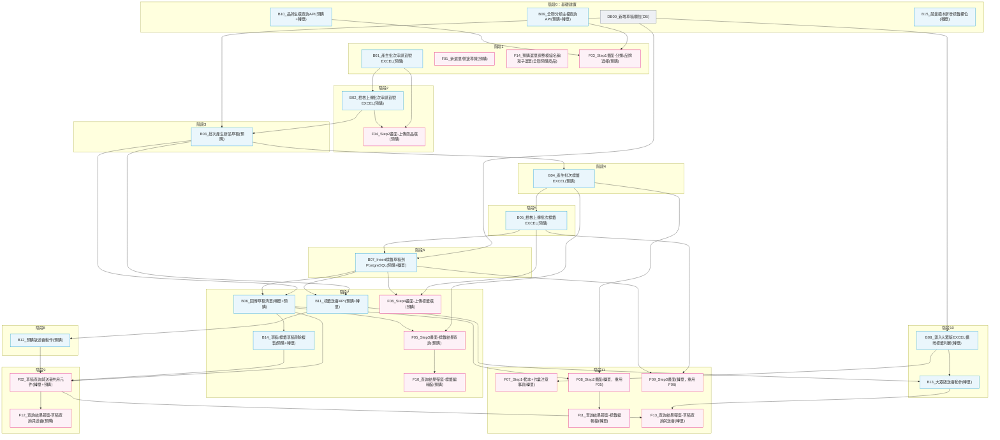

# SCM 預購/轉單批次提報(含標籤) — 系統分析及開發說明書

對應 Jira 主單：[ECB2E-9967](https://pxec.atlassian.net/browse/ECB2E-9967)「SCM>預購>批次申請全聯貨號(UIUX重構)」
詳細項目說明、對應步驟、依賴理由請參閱《SCM預購轉單標籤化_WBS分析與建議.md》，本文件僅彙整「完整 WBS 清單（含 Jira 連結）」與「開發順序流程圖」兩項。

## 目錄

- [1. 開發 WBS — Jira 主單與子任務清單](#1-開發-wbs-jira-主單與子任務清單)
  - [1.1 主單](#11-主單)
  - [1.2 子任務 — 後端／DB（16 張）](#12-子任務-後端db16-張)
  - [1.3 子任務 — 前端（14 張）](#13-子任務-前端14-張)
- [2. 開發順序流程圖（Mermaid）](#2-開發順序流程圖mermaid)

---

## 1. 開發 WBS — Jira 主單與子任務清單

### 1.1 主單

| Jira Key | 名稱 | 類型 | 狀態 | 連結 |
|---|---|---|---|---|
| ECB2E-9967 | SCM>預購>批次申請全聯貨號(UIUX重構) | 故事(Story) | 待辦事項 | https://pxec.atlassian.net/browse/ECB2E-9967 |

### 1.2 子任務 — 後端／DB（16 張）

| 代號 | Jira Key | Ticket 名稱 | 狀態 | 連結 |
|---|---|---|---|---|
| DB00 | ECB2E-10117 | SCM>批次>DB00_新增草稿欄位(標籤方式TagGenerateType、複製標籤TagCopyFrom)(DB) | 待辦事項 | https://pxec.atlassian.net/browse/ECB2E-10117 |
| B01 | ECB2E-10118 | SCM>批次>B01_產生批次申請貨號EXCEL(新品提報)(預購) | 待辦事項 | https://pxec.atlassian.net/browse/ECB2E-10118 |
| B02 | ECB2E-10119 | SCM>批次>B02_檢核上傳的批次申請貨號EXCEL(新品提報)(預購) | 待辦事項 | https://pxec.atlassian.net/browse/ECB2E-10119 |
| B03 | ECB2E-10120 | SCM>批次>B03_批次產生新品草稿(含小幫手和複製標籤)(新品提報)(預購) | 待辦事項 | https://pxec.atlassian.net/browse/ECB2E-10120 |
| B04 | ECB2E-10121 | SCM>批次>B04_產生批次標籤填寫的EXCEL(新增標籤)(預購) | 待辦事項 | https://pxec.atlassian.net/browse/ECB2E-10121 |
| B05 | ECB2E-10122 | SCM>批次>B05_檢核上傳的批次標籤EXCEL(新增標籤)(預購) | 待辦事項 | https://pxec.atlassian.net/browse/ECB2E-10122 |
| B06 | ECB2E-10123 | SCM>批次>B06_回傳新品草稿及標籤草稿清單給前端(轉單+預購) | 待辦事項 | https://pxec.atlassian.net/browse/ECB2E-10123 |
| B07 | ECB2E-10124 | SCM>批次>B07_Insert標籤草稿到PostgreSQL(新增標籤)(轉單+預購) | 待辦事項 | https://pxec.atlassian.net/browse/ECB2E-10124 |
| B08 | ECB2E-10125 | SCM>批次>B08_滙入大眾版新品提報EXCEL時擴增標籤判斷(轉單) | 待辦事項 | https://pxec.atlassian.net/browse/ECB2E-10125 |
| B09 | ECB2E-10126 | SCM>批次>B09_全聯分類（四層）主檔查詢API(預購+轉單) | 待辦事項 | https://pxec.atlassian.net/browse/ECB2E-10126 |
| B10 | ECB2E-10128 | SCM>批次>B10_品牌主檔查詢API(預購+轉單) | 待辦事項 | https://pxec.atlassian.net/browse/ECB2E-10128 |
| B11 | ECB2E-10130 | SCM>批次>B11_標籤送審API(預購+轉單) | 待辦事項 | https://pxec.atlassian.net/browse/ECB2E-10130 |
| B12 | ECB2E-10170 | SCM>批次>B12_預購版-草稿送審動作(呼叫標籤送審API)(預購) | 待辦事項 | https://pxec.atlassian.net/browse/ECB2E-10170 |
| B13 | ECB2E-10171 | SCM>批次>B13_大眾版-草稿送審動作(呼叫標籤送審API)(轉單) | 待辦事項 | https://pxec.atlassian.net/browse/ECB2E-10171 |
| B14 | ECB2E-10172 | SCM>批次>B14_草稿與標籤草稿 刪除／複製(預購+轉單) | 待辦事項 | https://pxec.atlassian.net/browse/ECB2E-10172 |
| B15 | ECB2E-10173 | SCM>批次>B15_大眾Step0-競業範本新增標籤欄位(轉單) | 待辦事項 | https://pxec.atlassian.net/browse/ECB2E-10173 |

跳號說明：ECB2E-10127、10129 並非遺漏，該二號未使用（非本專案 ticket）。

### 1.3 子任務 — 前端（14 張）

| 代號 | Jira Key | Ticket 名稱 | 狀態 | 連結 |
|---|---|---|---|---|
| F01 | ECB2E-10174 | SCM>批次>F01_新選單「商品批次作業」與側邊導覽(預購) | 待辦事項 | https://pxec.atlassian.net/browse/ECB2E-10174 |
| F02 | ECB2E-10175 | SCM>批次>F02_草稿與標籤草稿的查詢/編輯/下載/送審(轉單+預購) | 待辦事項 | https://pxec.atlassian.net/browse/ECB2E-10175 |
| F03 | ECB2E-10176 | SCM>批次>F03_Step1-全聯分類/品牌選擇與產生批次範本畫面(預購) | 待辦事項 | https://pxec.atlassian.net/browse/ECB2E-10176 |
| F04 | ECB2E-10177 | SCM>批次>F04_Step2-上傳商品檔畫面(預購) | 待辦事項 | https://pxec.atlassian.net/browse/ECB2E-10177 |
| F05 | ECB2E-10178 | SCM>批次>F05_Step3-下載標籤編輯檔查詢與結果畫面(預購) | 待辦事項 | https://pxec.atlassian.net/browse/ECB2E-10178 |
| F06 | ECB2E-10179 | SCM>批次>F06_Step4-上傳標籤檔畫面(預購) | 待辦事項 | https://pxec.atlassian.net/browse/ECB2E-10179 |
| F07 | ECB2E-10180 | SCM>批次>F07_Step1-範本增加標籤欄位及作業注意事項(轉單) | 待辦事項 | https://pxec.atlassian.net/browse/ECB2E-10180 |
| F08 | ECB2E-10181 | SCM>批次>F08_Step2-下載標籤編輯檔查詢與結果畫面(轉單) | 待辦事項 | https://pxec.atlassian.net/browse/ECB2E-10181 |
| F09 | ECB2E-10182 | SCM>批次>F09_Step3-上傳標籤檔畫面(轉單) | 待辦事項 | https://pxec.atlassian.net/browse/ECB2E-10182 |
| F10 | ECB2E-10183 | SCM>批次>F10_查詢結果彈窗-標籤編輯檔(預購) | 待辦事項 | https://pxec.atlassian.net/browse/ECB2E-10183 |
| F11 | ECB2E-10184 | SCM>批次>F11_查詢結果彈窗-標籤編輯檔(轉單) | 待辦事項 | https://pxec.atlassian.net/browse/ECB2E-10184 |
| F12 | ECB2E-10185 | SCM>批次>F12_查詢結果彈窗-草稿查詢與送審(預購) | 待辦事項 | https://pxec.atlassian.net/browse/ECB2E-10185 |
| F13 | ECB2E-10186 | SCM>批次>F13_查詢結果彈窗-草稿查詢與送審(轉單) | 待辦事項 | https://pxec.atlassian.net/browse/ECB2E-10186 |
| F14 | ECB2E-10187 | SCM>批次>F14_預購選單調整模組名稱和子選單(全聯預購商品) | 待辦事項 | https://pxec.atlassian.net/browse/ECB2E-10187 |

子任務總計：DB 1 張 + 後端 15 張 + 前端 14 張 = 30 張，全數掛在主單 ECB2E-9967 之下。

---

## 2. 開發順序流程圖（Mermaid）

註：B15 為獨立項目（無前後依賴），圖中僅放在階段0，不影響其他節點的排序。共用元件 F02 在轉單（大眾）情境下的回歸測試由 QE 另行定義，圖中不再畫出。
